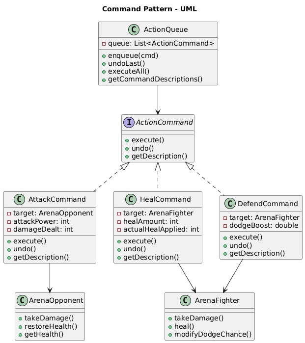
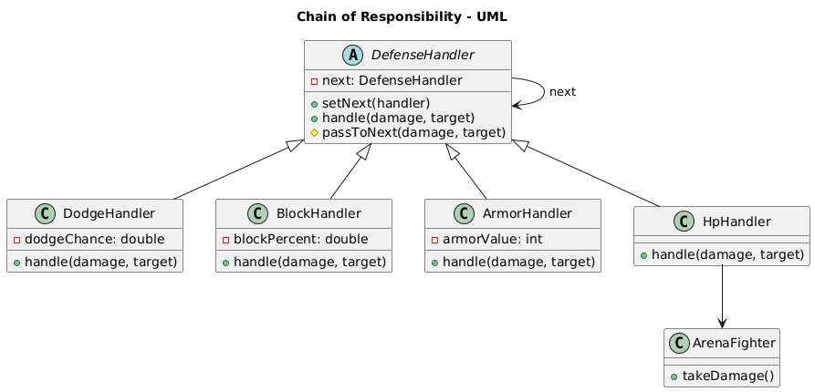

# Homework 6: RPG Grand Arena Tournament
## Chain of Responsibility + Command

---

## Overview

This homework continues the RPG series. You will implement two **behavioral** design patterns
in an arena tournament setting, building on the game world introduced in previous homeworks.

| Pattern | Role in this homework |
|---------|----------------------|
| **Command** | Encapsulate hero actions as objects, queue them, and support pre-execution undo |
| **Chain of Responsibility** | Route incoming damage through a sequence of defense handlers |

---

## Connection to Previous Homeworks

| Homework | Patterns | Scenario |
|----------|----------|----------|
| HW3 | Singleton + Adapter | BattleEngine manages hero vs enemy combatants |
| HW4 | Bridge + Composite | Raid mode — team hierarchies and skill-effect combinations |
| HW5 | Decorator + Facade | Dungeon run — decorated attacks, DungeonFacade workflow |
| **HW6** | **Chain of Responsibility + Command** | **Grand Arena Tournament** |

---

## What You Will Build

### Command Pattern
- `ActionCommand` interface (provided)
- `AttackCommand`, `HealCommand`, `DefendCommand` — encapsulate hero actions with execute/undo
- `ActionQueue` — the invoker: enqueue, undo, execute all

### Chain of Responsibility
- `DefenseHandler` abstract class (partially provided)
- `DodgeHandler`, `BlockHandler`, `ArmorHandler`, `HpHandler` — concrete defense handlers

### Integration
- `TournamentEngine` — runs multi-round battles using both patterns together
- `Main.java` demo — proves both patterns work, including an undo demo

---

## Project Structure

```
homework-rpg-6/
├── ASSIGNMENT.md          Full requirements and grading rubric
├── QUICKSTART.md          Setup, compile/run instructions, recommended order
├── STUDENT_CHECKLIST.md   Phase-by-phase checklist
├── AGENTS.md              Repo structure, build commands, coding style
└── src/com/narxoz/rpg/
    ├── Main.java
    ├── command/           ActionCommand, AttackCommand, HealCommand, DefendCommand, ActionQueue
    ├── chain/             DefenseHandler, DodgeHandler, BlockHandler, ArmorHandler, HpHandler
    ├── arena/             ArenaFighter, ArenaOpponent, TournamentResult
    ├── tournament/        TournamentEngine
    └── hints/             COMMAND_HINTS.md, CHAIN_HINTS.md
```

---

## Running the Project

Compile and run from the project root (PowerShell):

```powershell
javac -d out (Get-ChildItem -Recurse -Filter *.java src | ForEach-Object { $_.FullName })
java -cp out com.narxoz.rpg.Main
```

---

## Deliverables

1. All Java source files with TODOs implemented
2. `Main.java` demonstrating both patterns
3. Two UML class diagrams (Command hierarchy, Chain of Responsibility hierarchy)

### Command


### ChainOfResponsibility


## Ссылка на код
https://github.com/zarina-kulm/homework-rpg-6
